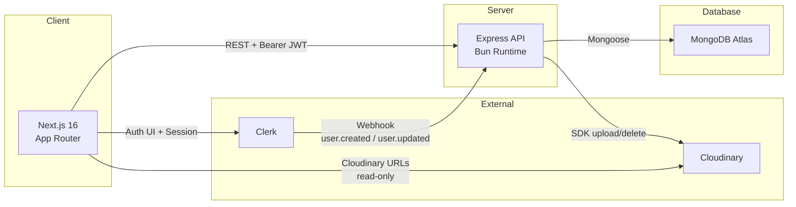
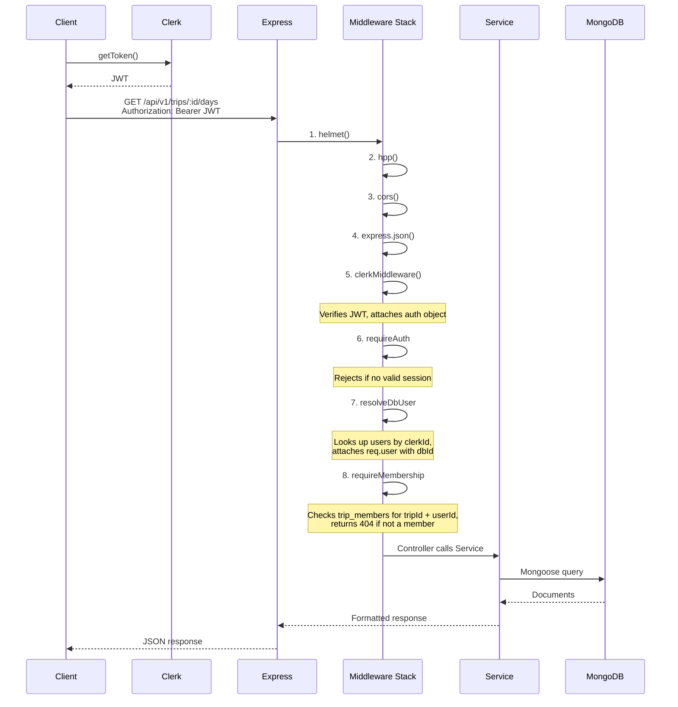
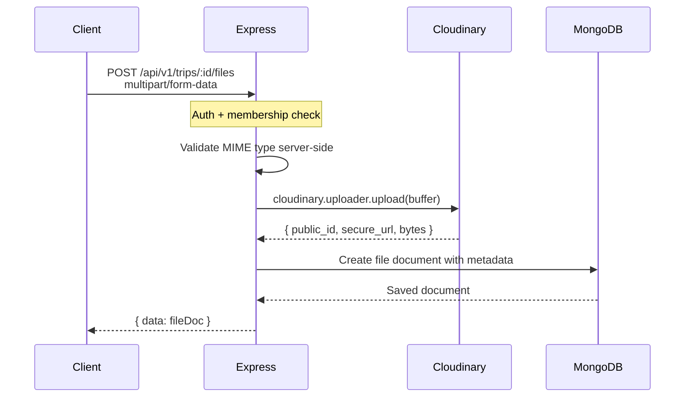
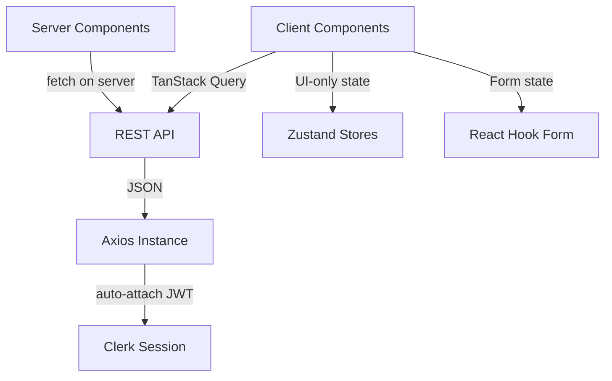
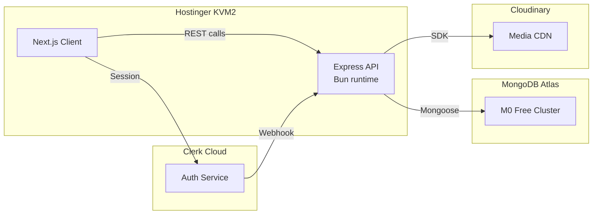

# System Architecture

> Tabi is a collaborative trip planning platform built with the MERN stack.

---

## High-Level Overview



**Three deployable units:**

1. **Client** (Next.js on Hostinger KVM2) handles rendering, routing, and client-side state.
2. **Server** (Express on Hostinger KVM2 with Bun runtime) handles business logic, data access, and file uploads.
3. **Database** (MongoDB Atlas M0) stores all application data.

Two external services are integrated:

- **Clerk** owns authentication entirely. The client uses Clerk's UI components and session management. The server verifies JWTs.
- **Cloudinary** handles media storage. Files go client → server → Cloudinary, never client → Cloudinary directly.

---

## Technology Choices and Trade-offs

### Why Next.js 16 App Router (not Pages Router, not plain React)

| Factor        | App Router                            | Pages Router / CRA               |
| ------------- | ------------------------------------- | -------------------------------- |
| SEO           | Built-in Metadata API, per-page OG    | Manual `<Head>` management       |
| Data fetching | Server Components + RSC               | `getServerSideProps` boilerplate |
| Route groups  | `(auth)` grouping without URL nesting | Not possible                     |
| Streaming     | Native with `loading.tsx`             | Not supported                    |

The App Router is the right choice here because trip detail pages benefit from server-side metadata generation (for OG sharing links) and the route group pattern cleanly separates auth pages from the main app.

**Trade-off accepted:** App Router has a steeper learning curve and some libraries (Recharts, react-day-picker) need `'use client'` wrappers since they rely on browser APIs.

### Why Express + Bun (not Next.js API Routes)

Keeping the API separate from the Next.js app is a deliberate choice:

1. **Independent scaling.** Both the API and frontend are deployed on Hostinger KVM2, keeping everything on one server and simplifying infrastructure management.
2. **Middleware control.** Express middleware ordering (Helmet → HPP → CORS → JSON → Auth → Route) is explicit and testable. Next.js API routes don't give this level of control.
3. **Bun performance.** Bun as the runtime gives faster cold starts and lower memory usage compared to Node.js on the same hardware.
4. **Testability.** Supertest can bind directly to the Express `app` object without starting a server, making integration tests fast and deterministic.

**Trade-off accepted:** Two separately deployed services means CORS configuration and managing two deployment pipelines. But for this project size, the operational overhead is minimal.

### Why MongoDB (not PostgreSQL)

The MERN stack constraint mandates MongoDB. But even without the constraint:

- Trip data is inherently hierarchical (trip → days → activities), and MongoDB's document model maps well to this.
- The schema is well-defined enough for Mongoose to enforce structure, which solves MongoDB's usual "schemaless chaos" problem.
- MongoDB Atlas M0 is free, which matters for a hackathon.

**Trade-off accepted:** No foreign key constraints. Referential integrity is enforced in application code (Mongoose refs + service-layer cascade deletes). This is acceptable because all writes go through a single API server, so there's no risk of concurrent processes bypassing the integrity checks.

### Why Clerk (not custom auth)

- Zero auth backend code. No password hashing, no session tables, no refresh token rotation.
- Pre-built UI components (`<SignIn />`, `<SignUp />`) that can be themed.
- Webhook-based user sync is a one-time setup.

**Trade-off accepted:** Vendor lock-in on authentication. If Clerk's free tier (10k MAU) is exceeded, there's a cost. But for a hackathon project, this is a non-concern.

---

## Request Lifecycle

Every authenticated API request follows this exact path:



### Middleware Stack

| Order | Middleware           | Scope  | Purpose                                                |
| ----- | -------------------- | ------ | ------------------------------------------------------ |
| 1     | `helmet()`           | Global | Security headers (CSP, HSTS, X-Frame-Options, etc.)    |
| 2     | `hpp()`              | Global | Prevents HTTP Parameter Pollution                      |
| 3     | `cors()`             | Global | Restricts origins to `CLIENT_URL`                      |
| 4     | `express.json()`     | Global | Parses JSON body, 10MB limit                           |
| 5     | `clerkMiddleware()`  | Global | Verifies Clerk JWT on every request                    |
| 6     | `requireAuth`        | Route  | Rejects unauthenticated requests                       |
| 7     | `resolveDbUser`      | Route  | Maps `clerkId` → internal `userId` on `req.user`       |
| 8     | `requireMembership`  | Route  | Checks `trip_members` for access. Returns 403 if not a member |
| 9     | `requireRole(roles)` | Route  | Further restricts to specific roles (owner, editor)    |
| 10    | `validate(schema)`   | Route  | Zod validation on `req.body`                           |

Middleware 1-5 runs on every request. Middleware 6-10 is applied per-route as needed.

---

## Server Architecture

### Layered Design

```
routes/        → HTTP layer. Wires middleware + calls controllers.
controllers/   → Request/response handling. Validates, calls service, formats response.
services/      → Business logic. All DB operations, validations, orchestration.
models/        → Mongoose schemas and model definitions.
middleware/    → Auth, permissions, validation, error handling.
lib/           → Utility modules (db connection, cloudinary config).
```

**Rules:**

- Routes never touch the database directly.
- Controllers never import Mongoose models directly.
- Services are the only layer that interacts with models.
- A service function can call other service functions (e.g., `deleteTripCascade` calls `deleteAllTripMembers`, `deleteAllDays`, etc.).

### Error Handling Strategy

All errors flow through a centralized error handler middleware at the bottom of the middleware stack:

```
Controller catches service errors
  → If known error (validation, not found, forbidden): returns structured JSON with status code
  → If unknown error: passes to Express error handler → returns 500 with generic message

Service throws typed errors:
  → NotFoundError (404)
  → ForbiddenError (403 or 404 depending on context)
  → ValidationError (400)
  → ConflictError (409, e.g., duplicate invite)
```

### File Upload Flow



The client never gets Cloudinary credentials. All uploads are proxied through the server.

---

## Client Architecture

### Data Flow



**Server data** (trips, activities, members, expenses) lives entirely in TanStack Query.
**UI state** (active day, sidebar toggle, command palette) lives in Zustand.
**Form state** (create trip, add activity) lives in React Hook Form, validated by Zod.

These three state domains never overlap. This is enforced by convention, not by tooling.

### Component Organization

```
components/
├── ui/              # shadcn base components (Button, Card, Input, etc.)
├── shared/          # App-wide reusable (Header, Sidebar, EmptyState, etc.)
├── trips/           # Trip list, trip card, create trip form
├── itinerary/       # Day card, activity card, drag-and-drop
├── members/         # Member list, invite form, role badge
├── budget/          # Expense table, budget chart, summary card
```

Each feature folder contains components specific to that feature. Components in `shared/` are feature-agnostic.

### Query Invalidation Strategy

TanStack Query uses a centralized key factory (`lib/queryKeys.ts`) that enables targeted invalidation:

| Mutation             | Invalidates                     | Why                              |
| -------------------- | ------------------------------- | -------------------------------- |
| Create/update trip   | `queryKeys.trips()`             | Dashboard list needs refresh     |
| Add/reorder activity | `queryKeys.tripDays(tripId)`    | Day view shows activities inline |
| Add/delete expense   | `queryKeys.tripBudget(tripId)`  | Budget summary recalculates      |
| Invite/remove member | `queryKeys.tripMembers(tripId)` | Member list updates              |

Optimistic updates are used for **reordering activities** and **toggling checklist items** because these are frequent, low-risk operations where instant feedback matters more than consistency guarantees.

---

## Security Model

### Authentication Flow

```
1. User signs in via Clerk UI components (client-side)
2. Clerk manages the session JWT (automatic rotation, no refresh tokens)
3. On every API call, Axios interceptor calls Clerk.session.getToken()
4. Server verifies JWT via @clerk/express middleware
5. resolveDbUser middleware maps clerkId → internal user ObjectId
```

There is no custom token table, no refresh token logic, no session storage on the server. Clerk handles all of this.

### Authorization Model

Two layers:

1. **Membership check** (`requireMembership`): "Is this user a member of this trip?" Returns **404** (not 403) to avoid leaking trip existence.
2. **Role check** (`requireRole`): "Does this member have the right role?" Applied on routes that require specific permissions (e.g., only owners can delete trips).

The permissions matrix from the PRD is enforced at the middleware level, not just hidden in the UI. This means even if someone crafts a direct API call, they can't bypass role restrictions.

### Input Validation

All user input is validated twice:

1. **Client-side** via React Hook Form + Zod (for immediate feedback).
2. **Server-side** via Zod middleware (for security, because client validation can be bypassed).

Both layers use the same Zod schemas from `shared/validations/`.

---

## Deployment Architecture



| Service  | Platform       | Why this platform                                      |
| -------- | -------------- | ------------------------------------------------------ |
| Client   | Hostinger KVM2 | Next.js frontend, co-located with API server           |
| Server   | Hostinger KVM2 | Bun support, persistent process, low cost              |
| Database | MongoDB Atlas  | Free M0 cluster, managed backups, Atlas UI             |
| Auth     | Clerk          | Managed auth with generous free tier (10k MAU)         |
| Media    | Cloudinary     | Free tier (25GB), built-in image transformations       |

### Environment Variable Separation

Each deployment target has its own set of environment variables. The server and client never share secrets:

- **Client** only has `NEXT_PUBLIC_*` variables (publishable Clerk key, API URL).
- **Server** has all secrets (Clerk secret key, MongoDB URI, Cloudinary credentials).
- **Clerk secret key** appears in both the client (for server-side Next.js operations) and the server, but the client's copy is a `CLERK_SECRET_KEY` that is NOT prefixed with `NEXT_PUBLIC_` and is therefore never exposed to the browser.

---

## Testing Strategy

### Server Testing

| Layer         | Tool                  | What it tests                              |
| ------------- | --------------------- | ------------------------------------------ |
| Integration   | Vitest + Supertest    | Full request lifecycle (middleware → DB)   |
| Database      | mongodb-memory-server | In-memory MongoDB for fast, isolated tests |
| Unit (future) | Vitest                | Service-layer business logic in isolation  |

The test setup (`src/test/setup.ts`) spins up an in-memory MongoDB via `mongodb-memory-server`, connects Mongoose, clears all collections between tests, and tears down after the suite completes. Tests import the Express `app` directly (from `src/app.ts`) without calling `app.listen()`, so there are no port conflicts.

### Client Testing (future)

Client testing is deferred to after core features are built. When implemented, it will use Vitest + React Testing Library for component tests and Playwright for E2E flows (login, create trip, invite member).

---

## Shared Code Strategy

The `shared/` directory contains TypeScript types and Zod schemas used by both client and server:

```
shared/
├── types/index.ts        # All 13 collection interfaces + enums + API response types
├── validations/index.ts  # All Zod schemas for create/update payloads
└── index.ts              # Barrel export
```

**How it's consumed:**

- **Server:** Direct filesystem import (`import { CreateTripSchema } from '../../shared/index.ts'`).
- **Client:** Direct filesystem import via TypeScript path alias configured in `tsconfig.json`.

There's no npm publishing or package linking. Both the client and server reference `shared/` directly because they live in the same repository. This works because both use TypeScript and both build tools (Next.js and Bun) can resolve the imports.
