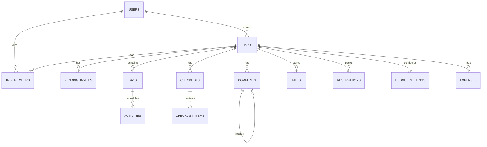

# Database Design

> MongoDB (Atlas M0) via Mongoose 9.x. All ObjectId references use Mongoose `Schema.Types.ObjectId` with `ref`.

---

## Entity Relationship Overview



---

## 1. Users

Synced from Clerk via webhook. This is a **read-mostly** collection where the application only writes on `user.created` and `user.updated` Clerk events. Every other collection references users through `ObjectId`, never through `clerkId` directly.

| Field       | Type     | Required | Default    | Notes                            |
| ----------- | -------- | -------- | ---------- | -------------------------------- |
| `_id`       | ObjectId | auto     |            | Mongoose default                 |
| `clerkId`   | String   | yes      |            | Unique. Clerk's external user ID |
| `email`     | String   | yes      |            | Unique. Synced from Clerk        |
| `name`      | String   | yes      |            | Display name                     |
| `avatarUrl` | String   | no       | `""`       | Clerk-hosted profile image URL   |
| `createdAt` | Date     | auto     | `Date.now` | Mongoose timestamps              |
| `updatedAt` | Date     | auto     | `Date.now` | Mongoose timestamps              |

**Indexes:**
| Index | Type | Rationale |
|----------------------|--------|--------------------------------------------------------|
| `{ clerkId: 1 }` | Unique | Webhook lookups: find user by Clerk ID on every auth |
| `{ email: 1 }` | Unique | Invite resolution: match pending invites by email |

**Design decisions:**

- `updatedAt` added because Clerk `user.updated` events need a timestamp to track sync freshness.
- We don't store any auth tokens. Clerk owns the session lifecycle entirely.

---

## 2. Trips

The central entity. Every other collection (except `users`) hangs off a trip via `tripId`.

| Field           | Type     | Required | Default    | Notes                                 |
| --------------- | -------- | -------- | ---------- | ------------------------------------- |
| `_id`           | ObjectId | auto     |            |                                       |
| `title`         | String   | yes      |            | Max 100 chars                         |
| `description`   | String   | no       | `""`       | Max 500 chars                         |
| `startDate`     | Date     | yes      |            |                                       |
| `endDate`       | Date     | yes      |            | Must be >= startDate                  |
| `travelerCount` | Number   | no       | `1`        | Min 1                                 |
| `coverImageUrl` | String   | no       | `""`       | Cloudinary URL                        |
| `createdBy`     | ObjectId | yes      |            | Ref → `users`. Immutable after create |
| `createdAt`     | Date     | auto     | `Date.now` |                                       |
| `updatedAt`     | Date     | auto     | `Date.now` |                                       |

**Indexes:**
| Index | Type | Rationale |
|--------------------|--------|------------------------------------------------------------|
| `{ createdBy: 1 }` | Normal | Dashboard query: "show me all trips I created" |

> [!NOTE]
> The dashboard query ("show me my trips") actually goes through `trip_members` first (find all trips where userId = me, status = active), then populates the trip. So the primary query path is via `trip_members`, not this index. The `createdBy` index is a secondary access path for admin-like queries.

**Design decisions:**

- `travelerCount` defaults to 1 instead of being derived from member count. This is intentional because the trip owner might set it for planning purposes before all members have joined ("we'll be 6 people"). It's a planning hint, not an exact count.
- `startDate` and `endDate` are stored as `Date` (midnight UTC). When the trip is created, the server auto-generates `Day` documents for each date in the range, ensuring the itinerary skeleton exists immediately.

---

## 3. Trip Members

The junction table between users and trips. This is the **most queried collection** in the system because every single authenticated API request to a trip resource needs to verify membership first.

| Field       | Type     | Required | Default    | Notes                                 |
| ----------- | -------- | -------- | ---------- | ------------------------------------- |
| `_id`       | ObjectId | auto     |            |                                       |
| `tripId`    | ObjectId | yes      |            | Ref → `trips`                         |
| `userId`    | ObjectId | yes      |            | Ref → `users`                         |
| `role`      | String   | yes      |            | Enum: `owner`, `editor`, `viewer`     |
| `status`    | String   | yes      | `"active"` | Enum: `active`, `pending`             |
| `invitedBy` | ObjectId | yes      |            | Ref → `users`. Self-ref for the owner |
| `joinedAt`  | Date     | no       |            | Set when status changes to `active`   |
| `createdAt` | Date     | auto     | `Date.now` |                                       |

**Indexes:**
| Index | Type | Rationale |
|--------------------------------|----------------|---------------------------------------------------------------|
| `{ tripId: 1, userId: 1 }` | Unique Compound | Prevent duplicate memberships. Also serves the permission check: "is this user a member of this trip?" |
| `{ userId: 1, status: 1 }` | Compound | Dashboard query: "all active trips for this user" |

**Invariants (enforced in application code):**

1. Exactly **one** member with role `owner` per trip at all times.
2. The owner **cannot** leave or be removed without first transferring ownership.
3. Ownership transfer is a single atomic operation: update old owner to `editor`, update target to `owner`.

**Design decisions:**

- `status: "pending"` is used when an existing user is invited but hasn't accepted yet (the invite was sent to someone who already has an account). For email-only invites to non-users, we use `pending_invites` instead. This dual-path approach avoids creating user records for people who may never sign up.

---

## 4. Pending Invites

Invitations sent to email addresses that may or may not belong to existing users. These are ephemeral and designed to expire.

| Field       | Type     | Required | Default    | Notes                                          |
| ----------- | -------- | -------- | ---------- | ---------------------------------------------- |
| `_id`       | ObjectId | auto     |            |                                                |
| `tripId`    | ObjectId | yes      |            | Ref → `trips`                                  |
| `email`     | String   | yes      |            | Lowercased before storage                      |
| `role`      | String   | yes      |            | Enum: `editor`, `viewer` (never `owner`)       |
| `invitedBy` | ObjectId | yes      |            | Ref → `users`                                  |
| `token`     | String   | yes      |            | Unique. Cryptographically random (32-byte hex) |
| `expiresAt` | Date     | yes      |            | Default: 7 days from creation                  |
| `createdAt` | Date     | auto     | `Date.now` |                                                |

**Indexes:**
| Index | Type | Rationale |
|-------------------------------|--------|-----------------------------------------------------------|
| `{ token: 1 }` | Unique | Accept/decline flow: lookup invite by URL token |
| `{ tripId: 1, email: 1 }` | Unique | Prevent duplicate invites to the same email for same trip |
| `{ expiresAt: 1 }` | TTL | MongoDB auto-deletes expired invites. `expireAfterSeconds: 0` |

**Design decisions:**

- The `expiresAt` TTL index lets MongoDB garbage-collect expired invites automatically without a cron job.
- `role` excludes `owner` by type constraint. Ownership can only be transferred, never invited.
- When an invite is accepted, the invite document is deleted and a `trip_members` document is created in the same logical operation.

---

## 5. Days

One document per calendar date within a trip's date range. Auto-generated on trip creation, which means users never manually create days. They only edit meta on existing ones.

| Field       | Type     | Required | Default    | Notes                              |
| ----------- | -------- | -------- | ---------- | ---------------------------------- |
| `_id`       | ObjectId | auto     |            |                                    |
| `tripId`    | ObjectId | yes      |            | Ref → `trips`                      |
| `date`      | Date     | yes      |            | Midnight UTC for that calendar day |
| `label`     | String   | no       | `""`       | e.g. "Arrival Day", "Free Day"     |
| `notes`     | String   | no       | `""`       |                                    |
| `createdAt` | Date     | auto     | `Date.now` |                                    |

**Indexes:**
| Index | Type | Rationale |
|------------------------------|----------------|----------------------------------------------------------|
| `{ tripId: 1, date: 1 }` | Unique Compound | Prevent duplicate days. Also the primary query: "GET all days for this trip, sorted by date" |

**Design decisions:**

- Days are auto-generated when a trip is created. If the trip dates change (PATCH), the system adds or removes days accordingly. Days with existing activities are never silently deleted; the API should warn the client.
- `date` is stored at midnight UTC. All date math happens UTC-aligned on the server.

---

## 6. Activities

Individual items within a day. Support drag-to-reorder via a `position` float field.

| Field           | Type     | Required | Default    | Notes                                                                          |
| --------------- | -------- | -------- | ---------- | ------------------------------------------------------------------------------ |
| `_id`           | ObjectId | auto     |            |                                                                                |
| `dayId`         | ObjectId | yes      |            | Ref → `days`                                                                   |
| `tripId`        | ObjectId | yes      |            | Ref → `trips`. Denormalized for permission checks                              |
| `title`         | String   | yes      |            | Max 200 chars                                                                  |
| `type`          | String   | yes      |            | Enum: `sightseeing`, `food`, `transport`, `accommodation`, `activity`, `other` |
| `startTime`     | String   | no       |            | Format: `"HH:mm"`. Not a Date, since it's time-of-day only                     |
| `endTime`       | String   | no       |            | Format: `"HH:mm"`                                                              |
| `location`      | String   | no       | `""`       |                                                                                |
| `notes`         | String   | no       | `""`       |                                                                                |
| `estimatedCost` | Number   | no       |            | Used in budget projections                                                     |
| `position`      | Number   | yes      |            | Float for fractional ordering                                                  |
| `createdBy`     | ObjectId | yes      |            | Ref → `users`                                                                  |
| `createdAt`     | Date     | auto     | `Date.now` |                                                                                |
| `updatedAt`     | Date     | auto     | `Date.now` |                                                                                |

**Indexes:**
| Index | Type | Rationale |
|--------------------------------|----------|-----------------------------------------------------------------------|
| `{ dayId: 1, position: 1 }` | Compound | Primary query: "all activities for a day, sorted by position" |
| `{ tripId: 1 }` | Normal | Permission middleware and budget aggregations across the full trip |

**Design decisions:**

- **`tripId` is denormalized** onto activities even though it could be derived from `dayId → day.tripId`. This is intentional because the permission middleware needs `tripId` before it can authorize the request, and doing a join through `days` on every single activity request would be wasteful.
- **Fractional positioning:** When item A (position 1.0) is dragged between B (2.0) and C (3.0), the new position is `(2.0 + 3.0) / 2 = 2.5`. This avoids renumbering all items. After many reorders, positions might get extremely close (floating-point limits). A periodic "rebalancing" operation can renumber positions to clean integers, but this is a future optimization.
- **`startTime`/`endTime` are strings, not Dates.** Activities live within a `Day` that already knows its calendar date. Storing full ISO timestamps would create timezone ambiguity. A simple `"14:30"` string is unambiguous and easy to render.

---

## 7. Comments

Threaded comments attached to either a `Day` or an `Activity`. Supports exactly one level of nesting (replies to a comment, but no nested replies).

| Field        | Type     | Required | Default    | Notes                                         |
| ------------ | -------- | -------- | ---------- | --------------------------------------------- |
| `_id`        | ObjectId | auto     |            |                                               |
| `tripId`     | ObjectId | yes      |            | Ref → `trips`                                 |
| `targetType` | String   | yes      |            | Enum: `day`, `activity`                       |
| `targetId`   | ObjectId | yes      |            | Polymorphic ref to either a Day or Activity   |
| `body`       | String   | yes      |            | Max 2000 chars                                |
| `authorId`   | ObjectId | yes      |            | Ref → `users`                                 |
| `parentId`   | ObjectId | no       |            | Ref → `comments`. Null for top-level comments |
| `isEdited`   | Boolean  | yes      | `false`    |                                               |
| `createdAt`  | Date     | auto     | `Date.now` |                                               |
| `updatedAt`  | Date     | auto     | `Date.now` |                                               |

**Indexes:**
| Index | Type | Rationale |
|--------------------------------------------------|----------|--------------------------------------------------------------|
| `{ tripId: 1, targetType: 1, targetId: 1 }` | Compound | Primary query: "all comments on day X" or "all comments on activity Y" |

**Design decisions:**

- **Polymorphic reference** (`targetType` + `targetId`) instead of separate `dayId`/`activityId` fields. This keeps the schema flat and makes the comment query generic: filter by `(targetType, targetId)` regardless of what the target is.
- **Single-level threading only.** `parentId` can point to another comment, but the API should reject comments where the parent itself has a `parentId`. This keeps the UI simple and avoids deeply nested threads.
- `isEdited` is set to `true` on any PATCH to the comment body, providing transparency.

---

## 8. Checklists

Named lists (e.g., "Packing List", "Pre-Departure ToDo") that belong to a trip.

| Field       | Type     | Required | Default    | Notes                     |
| ----------- | -------- | -------- | ---------- | ------------------------- |
| `_id`       | ObjectId | auto     |            |                           |
| `tripId`    | ObjectId | yes      |            | Ref → `trips`             |
| `title`     | String   | yes      |            | Max 100 chars             |
| `position`  | Number   | yes      |            | Ordering among checklists |
| `createdBy` | ObjectId | yes      |            | Ref → `users`             |
| `createdAt` | Date     | auto     | `Date.now` |                           |

**Indexes:**
| Index | Type | Rationale |
|--------------------------------|----------|----------------------------------------------------------|
| `{ tripId: 1, position: 1 }` | Compound | "All checklists for this trip, ordered" |

---

## 9. Checklist Items

Individual checkable items within a checklist.

| Field         | Type     | Required | Default    | Notes                           |
| ------------- | -------- | -------- | ---------- | ------------------------------- |
| `_id`         | ObjectId | auto     |            |                                 |
| `checklistId` | ObjectId | yes      |            | Ref → `checklists`              |
| `label`       | String   | yes      |            | Max 200 chars                   |
| `isChecked`   | Boolean  | yes      | `false`    |                                 |
| `checkedBy`   | ObjectId | no       |            | Ref → `users`. Set when checked |
| `checkedAt`   | Date     | no       |            | Set when checked                |
| `position`    | Number   | yes      |            | Ordering within the checklist   |
| `createdAt`   | Date     | auto     | `Date.now` |                                 |

**Indexes:**
| Index | Type | Rationale |
|--------------------------------------|----------|---------------------------------------|
| `{ checklistId: 1, position: 1 }` | Compound | "All items for this checklist, ordered"|

**Design decisions:**

- `checkedBy` and `checkedAt` are set together atomically when a user checks an item, and both cleared when unchecked. This gives visibility into "who packed what."

---

## 10. Files

Metadata for files uploaded to Cloudinary. The actual binary lives in Cloudinary; MongoDB only stores the reference.

| Field           | Type     | Required | Default    | Notes                      |
| --------------- | -------- | -------- | ---------- | -------------------------- |
| `_id`           | ObjectId | auto     |            |                            |
| `tripId`        | ObjectId | yes      |            | Ref → `trips`              |
| `filename`      | String   | yes      |            | Cloudinary public_id       |
| `originalName`  | String   | yes      |            | User's original filename   |
| `mimeType`      | String   | yes      |            | Server-validated MIME type |
| `sizeBytes`     | Number   | yes      |            |                            |
| `cloudinaryId`  | String   | yes      |            | Cloudinary asset public_id |
| `cloudinaryUrl` | String   | yes      |            | Secure delivery URL        |
| `uploadedBy`    | ObjectId | yes      |            | Ref → `users`              |
| `createdAt`     | Date     | auto     | `Date.now` |                            |

**Indexes:**
| Index | Type | Rationale |
|------------------|--------|------------------------------------------|
| `{ tripId: 1 }` | Normal | "All files for this trip" |

**Design decisions:**

- MIME type is validated server-side, never trusting the file extension. The upload flow is: client sends file to Express, Express validates and uploads to Cloudinary, then stores the metadata here.
- When a file document is deleted, the server must also call `cloudinary.uploader.destroy()` to clean up the remote asset.

---

## 11. Reservations

Manual entries for flights, hotels, restaurants, etc. Not synced from any external system.

| Field                | Type     | Required | Default    | Notes                                                                    |
| -------------------- | -------- | -------- | ---------- | ------------------------------------------------------------------------ |
| `_id`                | ObjectId | auto     |            |                                                                          |
| `tripId`             | ObjectId | yes      |            | Ref → `trips`                                                            |
| `type`               | String   | yes      |            | Enum: `flight`, `hotel`, `car_rental`, `restaurant`, `activity`, `other` |
| `title`              | String   | yes      |            | Max 200 chars                                                            |
| `confirmationNumber` | String   | no       | `""`       | Displayed in monospace (JetBrains Mono)                                  |
| `provider`           | String   | no       | `""`       | Airline name, hotel chain, etc.                                          |
| `datetime`           | Date     | no       |            | Check-in time, flight departure, etc.                                    |
| `notes`              | String   | no       | `""`       |                                                                          |
| `fileId`             | ObjectId | no       |            | Ref → `files`. Optional attachment (e.g., booking confirmation PDF)      |
| `createdBy`          | ObjectId | yes      |            | Ref → `users`                                                            |
| `createdAt`          | Date     | auto     | `Date.now` |                                                                          |
| `updatedAt`          | Date     | auto     | `Date.now` |                                                                          |

**Indexes:**
| Index | Type | Rationale |
|------------------|--------|----------------------------------------------|
| `{ tripId: 1 }` | Normal | "All reservations for this trip" |

---

## 12. Budget Settings

One-to-one with a trip. Stores the overall budget configuration.

| Field         | Type     | Required | Default    | Notes                 |
| ------------- | -------- | -------- | ---------- | --------------------- |
| `_id`         | ObjectId | auto     |            |                       |
| `tripId`      | ObjectId | yes      |            | Ref → `trips`. Unique |
| `totalBudget` | Number   | yes      |            | Total planned budget  |
| `currency`    | String   | yes      | `"INR"`    | ISO 4217 code         |
| `createdAt`   | Date     | auto     | `Date.now` |                       |
| `updatedAt`   | Date     | auto     | `Date.now` |                       |

**Indexes:**
| Index | Type | Rationale |
|------------------|--------|------------------------------------------|
| `{ tripId: 1 }` | Unique | Enforces one budget config per trip |

---

## 13. Expenses

Individual expense entries tracked against the budget.

| Field         | Type     | Required | Default    | Notes                                                                        |
| ------------- | -------- | -------- | ---------- | ---------------------------------------------------------------------------- |
| `_id`         | ObjectId | auto     |            |                                                                              |
| `tripId`      | ObjectId | yes      |            | Ref → `trips`                                                                |
| `description` | String   | yes      |            | Max 200 chars                                                                |
| `amount`      | Number   | yes      |            | Always positive. In the currency defined in budget settings                  |
| `currency`    | String   | no       |            | Override if different from budget's default                                  |
| `category`    | String   | yes      |            | Enum: `accommodation`, `food`, `transport`, `activities`, `shopping`, `misc` |
| `paidBy`      | ObjectId | yes      |            | Ref → `users`. Who actually paid                                             |
| `date`        | Date     | no       |            | When the expense occurred                                                    |
| `activityId`  | ObjectId | no       |            | Ref → `activities`. Links expense to a specific activity                     |
| `createdBy`   | ObjectId | yes      |            | Ref → `users`. Who logged this entry                                         |
| `createdAt`   | Date     | auto     | `Date.now` |                                                                              |
| `updatedAt`   | Date     | auto     | `Date.now` |                                                                              |

**Indexes:**
| Index | Type | Rationale |
|------------------------------|----------|----------------------------------------------------------------|
| `{ tripId: 1, category: 1 }` | Compound | Budget summary aggregation: group expenses by category per trip |
| `{ tripId: 1, paidBy: 1 }` | Compound | "How much did each person spend?" query |

---

## Cross-Cutting Concerns

### Soft Deletes vs Hard Deletes

All deletes are **hard deletes** for this project. Rationale:

- Hackathon scope: soft deletes add complexity (filtering `deletedAt: null` everywhere, cascading soft-delete logic).
- Trip deletion cascades: when a trip is deleted, all related documents (members, days, activities, comments, checklists, items, files, reservations, budget, expenses) are also deleted via application-level cascade in the service layer.

### Timestamps

All collections use Mongoose's `timestamps: true` option, which auto-manages `createdAt` and `updatedAt`. Some collections don't logically need `updatedAt` (e.g., `days`, `checklist_items`), but the overhead is negligible and consistency is more valuable.

### Cascading Deletions

When a **trip** is deleted, the following must be cleaned up (order doesn't matter since there are no foreign key constraints in MongoDB):

```
trip_members     WHERE tripId = ?
pending_invites  WHERE tripId = ?
days             WHERE tripId = ?
activities       WHERE tripId = ?
comments         WHERE tripId = ?
checklists       WHERE tripId = ?
checklist_items  WHERE checklistId IN (SELECT _id FROM checklists WHERE tripId = ?)
files            WHERE tripId = ?  (+ Cloudinary cleanup for each)
reservations     WHERE tripId = ?
budget_settings  WHERE tripId = ?
expenses         WHERE tripId = ?
```

This is implemented as a service-layer function (`deleteTripCascade`) that runs all deletions. Mongoose middleware (`pre('deleteOne')`) could also work, but explicit service-layer logic is more testable and transparent.

### Query Access Patterns Summary

| Query                                  | Collection(s)     | Index Used                                  |
| -------------------------------------- | ----------------- | ------------------------------------------- |
| Get user by Clerk ID (auth middleware) | `users`           | `{ clerkId: 1 }`                            |
| Dashboard: my trips                    | `trip_members`    | `{ userId: 1, status: 1 }`                  |
| Permission check: is user in trip?     | `trip_members`    | `{ tripId: 1, userId: 1 }`                  |
| Get all days for a trip                | `days`            | `{ tripId: 1, date: 1 }`                    |
| Get activities for a day               | `activities`      | `{ dayId: 1, position: 1 }`                 |
| Get comments for a target              | `comments`        | `{ tripId: 1, targetType: 1, targetId: 1 }` |
| Budget summary by category             | `expenses`        | `{ tripId: 1, category: 1 }`                |
| Accept invite by token                 | `pending_invites` | `{ token: 1 }`                              |
| Find user by email (invite resolution) | `users`           | `{ email: 1 }`                              |

### Collection Count

**13 collections** total: `users`, `trips`, `trip_members`, `pending_invites`, `days`, `activities`, `comments`, `checklists`, `checklist_items`, `files`, `reservations`, `budget_settings`, `expenses`.
